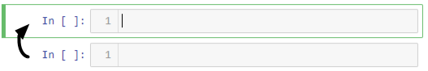
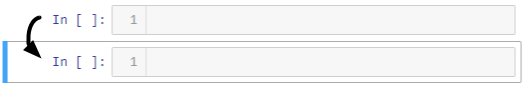
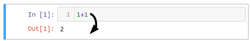

# Welcome to the open-source python training

This resource is intended to geoscientists wanting to gain python skills, take advantage of open-source algorithms and develop their own.
At the end of every module, trainees will be able to execute programs with a simple user-interface (UI)
accessible through [Geoscience ANALYST Pro](https://mirageoscience.com/mining-industry-software/geoscience-analyst/).

This training material uses the [jupyter-notebook](https://jupyter.org/) environment that is made up of text cells (
like this one) and code cells displayed within a web browser (no internet required). Participants are invited to
write and run the examples provided to get comfortable with the Python syntax. Here are few useful shortcuts for
jupyter-notebooks.

 - Press **esc + a** to add a cell above
 
 - Press **esc+b** to add a cell below.
 
 - Press **shift + enter** to run a selected cell.
 
 - Click on a cell and press **M** to convert to a text cell, or **Y** to convert to code cell.

# Table of content

```{tableofcontents}
```

 Copyright (c) 2022 Mira Geoscience Ltd.
